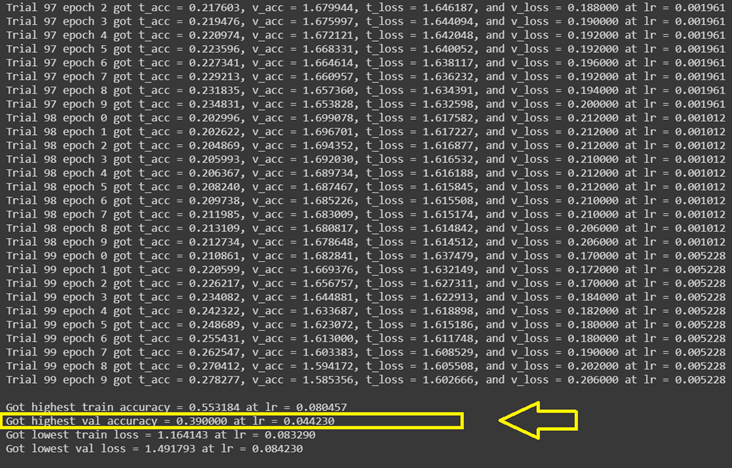
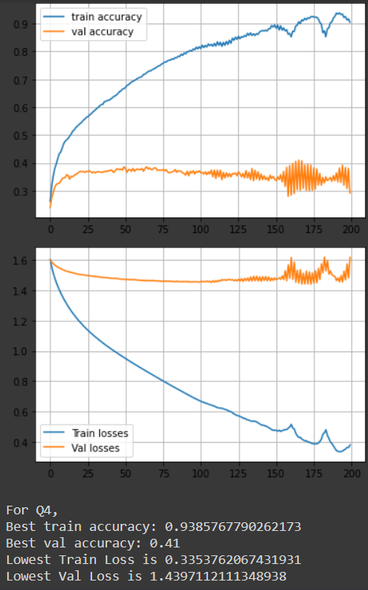
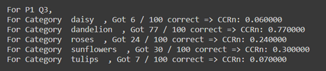
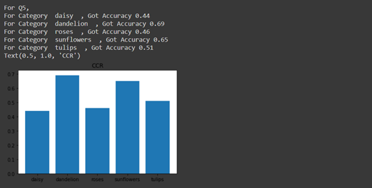
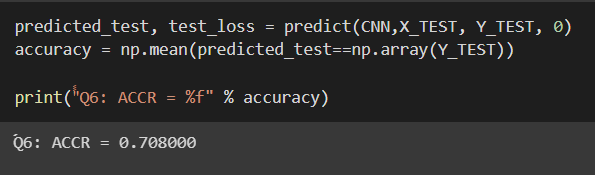
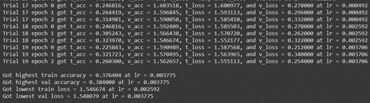
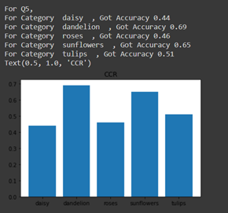
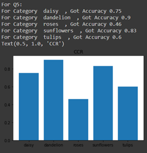
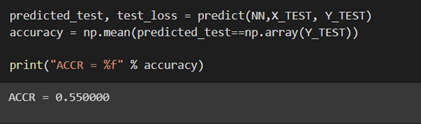

# CNN-from-scratch
Implementation of a multi-layer fully connected Convolutional Neural Network (CNN) classifier.

## 1. Neural Network (without convolutions)

For the data pre-processing, I have done three things:
1-	Normalizing the input data by dividing each of the RGB values by 255.
```
X_TRAIN = X_TRAIN.astype(float) / 255.
X_TEST = X_TEST.astype(float) / 255.
```

2-	Subtracting the mean from all data points in order to zero-center the data.
```
X_TRAIN -= np.mean(X_TRAIN, axis=0)
X_TEST -= np.mean(X_TEST, axis=0)
```

3-	Divided all data points by their standard deviation to minimize the spacing.
```
X_TRAIN /= np.std(X_TRAIN, axis=0)
X_TEST /= np.std(X_TEST, axis=0)
```

### Choosing the network architecture:
For the number of layers, I have tried using from 1 to 10 layers and I found that applying more than 2 layers causes the model to over-fit very quickly with no virtual increase in the validation or test accuracies. So, after trying different architectures, I chose two layers, each with 200 nodes.

### Tuning hyper-parameters:
I have used a guided search approach by first starting with small learning rate (10-6) that makes the loss go down. That made the loss go down, but it was virtually not changing (meaning that learning rate has to be increased). After increasing the learning rate to make the loss explode (with very high learning rate), I tuned the random search range to be between 10-1 and 10-3 with big search range (100 loops, each with a different rate tried with 10 epochs) and finally I chose the learning rate that corresponds to the highest validation accuracy.

<p align="center">

</p>

### Training and validation losses
As can be seen from the graphs below, I stopped the training after epoch 200 because the training and validation accuracies are not increasing anymore.  This also saturates at a training accuracies that are in the 90s range and validation accuracies that are in the 40s range which passes the sanity checks (since validation should be close to 1 and validation should be close to 0.5).

<p align="center">

</p>

### Comparison to KNN classifier

K-NN classifier:

<p align="center">

</p>

Neural Network:

<p align="center">

</p>

As can be shown from the screenshots above, the performance of the neural network is much better than the K-NN in almost all categories. 

### Average Correct Classification Rate (ACCR)

<p align="center">

</p>

Final ACCR achieved on the test set is 55%

## 2. Convolutional Neural Network (CNN)

Data were separated into three partitions: one of training, one for validation (500 images), and one for testing (500 images). All images were divided by 255 to normalize RGB values between 0 and 1 as follows:
```
X_TRAIN = X_TRAIN.astype(float) / 255.
X_TEST = X_TEST.astype(float) / 255.
```

Data were not flattened at the beginning because CNN takes images as they are without flattening so this part was removed.

### Choosing network architecture 
For the convolution part, the network architecture design was guided by AlexNet architecture. I’ve tried multiple conv and pooling layers and multiple combinations and the following design was empirically better:
```
CNN = []

CNN.append(conv_layer(8, (3,3,3), lr))
CNN.append(ReLU())
CNN.append(pool_layer((2,2)))

CNN.append(conv_layer(16, (3,3,8) , lr))
CNN.append(ReLU())
CNN.append(pool_layer((2,2)))

CNN.append(conv_layer(32, (3,3,16), lr))
CNN.append(ReLU())
CNN.append(pool_layer((2,2)))
```

Then, another layer was added to reshape the output of conv layers in order to prepare it for the dense layers:
```
CNN.append(reshape_layer())
```


As for the dense network architecture, I’ve reduced the number of hidden neurons to reduce model complexity and I’ve added dropout layers after every ReLU layer in order to prevent overfitting:
```
CNN.append(weights_layer(128,100,lr))
CNN.append(ReLU())
CNN.append(dropout_layer(0.5))
CNN.append(weights_layer(100,100,lr))
CNN.append(ReLU())
CNN.append(dropout_layer(0.5))
CNN.append(weights_layer(100,5,lr))
```

### Fine tuning hyperparameters
1-	Learning rate: best learning rate was found using guided random search over 20 random values; the value the corresponded to lowest validation loss was chosen.

<p align="center">

</p>

I have also tried a couple of other values of learning rate that were around the one chosen by the guided random search and found it was best at lr=0.0007 which yielded the lowest validation loss and highest validation accuracy.
2-	Beta1 and beta2 (of Adam): were substituted by the recommended values by tensor flow.
3-	Dropout: was empirically found to be best at 0.5 after trying many values over 200 epochs.

### Losses
<p align="center">

</p>

The first graph shows a plot of training and validation accuracies vs number of epochs. The second graph shows a plot of training and validation losses vs number of epochs.
I stopped the training at epoch 150 because the training and validation losses were not decreasing anymore (in fact they might have started to increase) and also because the validation accuracy seemed to have saturated as can be seen from the first graph.

### Comparisons
KNN Correct Classification Rate CCR performance:

<p align="center">

</p>

FCN CCR performance:
<p align="center">

</p>

CNN CCR performance:
<p align="center">

</p>

As shown, the performance of CNN is better than FCN in all classes and with a significant margin.

### Final Average Correct Classification Rate (ACCR)

<p align="center">

</p>

Final ACCR achieved on the test set is ~ 71%


